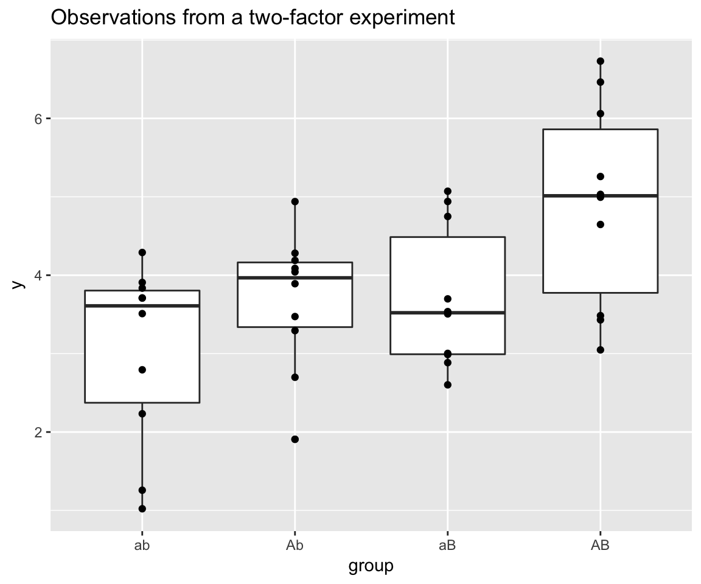
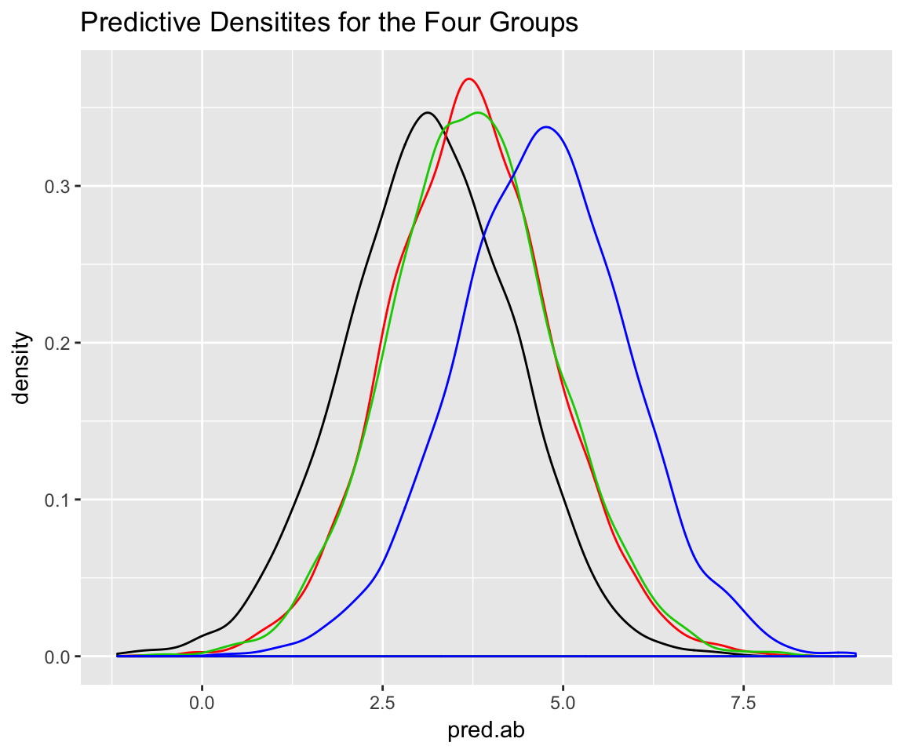

# Prediction

Let's look at the same problem from a predictive perspective. Suppose we are
interested in reproducible results; reproducible in the sense that future
observations (or means of samples of observations) are affected by Aa, Bb, or
their combination.  As before we fit a Bayesian hierarchial model to the frauda


<!-- ```{r init, echo=F} -->
<!-- library(knitr) -->
<!-- Hmisc::knitrSet(w=7, h=5, lang='markdown') ## omit the ## at the beginning of R output -->
<!-- ## lines -->
<!-- ##args(Hmisc::knitrSet) -->
<!-- ``` -->




```
## Compiling the C++ model
```

```
## Start sampling
```

```
## 
## SAMPLING FOR MODEL 'gaussian(identity) brms-model' NOW (CHAIN 1).
## 
## Chain 1, Iteration:    1 / 2000 [  0%]  (Warmup)
## Chain 1, Iteration:  200 / 2000 [ 10%]  (Warmup)
## Chain 1, Iteration:  400 / 2000 [ 20%]  (Warmup)
## Chain 1, Iteration:  600 / 2000 [ 30%]  (Warmup)
## Chain 1, Iteration:  800 / 2000 [ 40%]  (Warmup)
## Chain 1, Iteration: 1000 / 2000 [ 50%]  (Warmup)
## Chain 1, Iteration: 1001 / 2000 [ 50%]  (Sampling)
## Chain 1, Iteration: 1200 / 2000 [ 60%]  (Sampling)
## Chain 1, Iteration: 1400 / 2000 [ 70%]  (Sampling)
## Chain 1, Iteration: 1600 / 2000 [ 80%]  (Sampling)
## Chain 1, Iteration: 1800 / 2000 [ 90%]  (Sampling)
## Chain 1, Iteration: 2000 / 2000 [100%]  (Sampling)
##  Elapsed Time: 0.167906 seconds (Warm-up)
##                0.278635 seconds (Sampling)
##                0.446541 seconds (Total)
## 
## 
## SAMPLING FOR MODEL 'gaussian(identity) brms-model' NOW (CHAIN 2).
## 
## Chain 2, Iteration:    1 / 2000 [  0%]  (Warmup)
## Chain 2, Iteration:  200 / 2000 [ 10%]  (Warmup)
## Chain 2, Iteration:  400 / 2000 [ 20%]  (Warmup)
## Chain 2, Iteration:  600 / 2000 [ 30%]  (Warmup)
## Chain 2, Iteration:  800 / 2000 [ 40%]  (Warmup)
## Chain 2, Iteration: 1000 / 2000 [ 50%]  (Warmup)
## Chain 2, Iteration: 1001 / 2000 [ 50%]  (Sampling)
## Chain 2, Iteration: 1200 / 2000 [ 60%]  (Sampling)
## Chain 2, Iteration: 1400 / 2000 [ 70%]  (Sampling)
## Chain 2, Iteration: 1600 / 2000 [ 80%]  (Sampling)
## Chain 2, Iteration: 1800 / 2000 [ 90%]  (Sampling)
## Chain 2, Iteration: 2000 / 2000 [100%]  (Sampling)
##  Elapsed Time: 0.1738 seconds (Warm-up)
##                0.171809 seconds (Sampling)
##                0.345609 seconds (Total)
## 
## 
## SAMPLING FOR MODEL 'gaussian(identity) brms-model' NOW (CHAIN 3).
## 
## Chain 3, Iteration:    1 / 2000 [  0%]  (Warmup)
## Chain 3, Iteration:  200 / 2000 [ 10%]  (Warmup)
## Chain 3, Iteration:  400 / 2000 [ 20%]  (Warmup)
## Chain 3, Iteration:  600 / 2000 [ 30%]  (Warmup)
## Chain 3, Iteration:  800 / 2000 [ 40%]  (Warmup)
## Chain 3, Iteration: 1000 / 2000 [ 50%]  (Warmup)
## Chain 3, Iteration: 1001 / 2000 [ 50%]  (Sampling)
## Chain 3, Iteration: 1200 / 2000 [ 60%]  (Sampling)
## Chain 3, Iteration: 1400 / 2000 [ 70%]  (Sampling)
## Chain 3, Iteration: 1600 / 2000 [ 80%]  (Sampling)
## Chain 3, Iteration: 1800 / 2000 [ 90%]  (Sampling)
## Chain 3, Iteration: 2000 / 2000 [100%]  (Sampling)
##  Elapsed Time: 0.181219 seconds (Warm-up)
##                0.158085 seconds (Sampling)
##                0.339304 seconds (Total)
## 
## 
## SAMPLING FOR MODEL 'gaussian(identity) brms-model' NOW (CHAIN 4).
## 
## Chain 4, Iteration:    1 / 2000 [  0%]  (Warmup)
## Chain 4, Iteration:  200 / 2000 [ 10%]  (Warmup)
## Chain 4, Iteration:  400 / 2000 [ 20%]  (Warmup)
## Chain 4, Iteration:  600 / 2000 [ 30%]  (Warmup)
## Chain 4, Iteration:  800 / 2000 [ 40%]  (Warmup)
## Chain 4, Iteration: 1000 / 2000 [ 50%]  (Warmup)
## Chain 4, Iteration: 1001 / 2000 [ 50%]  (Sampling)
## Chain 4, Iteration: 1200 / 2000 [ 60%]  (Sampling)
## Chain 4, Iteration: 1400 / 2000 [ 70%]  (Sampling)
## Chain 4, Iteration: 1600 / 2000 [ 80%]  (Sampling)
## Chain 4, Iteration: 1800 / 2000 [ 90%]  (Sampling)
## Chain 4, Iteration: 2000 / 2000 [100%]  (Sampling)
##  Elapsed Time: 0.159684 seconds (Warm-up)
##                0.177277 seconds (Sampling)
##                0.336961 seconds (Total)
```

```
## Warning: There were 14 divergent transitions after warmup. Increasing adapt_delta above 0.9 may help. See
## http://mc-stan.org/misc/warnings.html#divergent-transitions-after-warmup
```

```
## Warning: Examine the pairs() plot to diagnose sampling problems
```

```
## Pr(ab < Ab) Pr(ab < Ab) Pr(ab < AB) Pr(Ab < AB) Pr(aB < AB) 
##     0.63700     0.64250     0.81800     0.72125     0.72200
```

```
## pred.string
##    1324    1234    2134    3124    1243    1342    3214    2314    2143 
## 0.12700 0.12625 0.09350 0.07475 0.06575 0.06475 0.06075 0.05700 0.04275 
##    3142    1432    1423    3241    2341    2413    3412    4132    4123 
## 0.04050 0.03525 0.03300 0.02525 0.02100 0.01900 0.01775 0.01550 0.01475 
##    3421    2431    4312    4213    4231    4321 
## 0.01400 0.01325 0.01050 0.00950 0.00925 0.00900
```



## Predicting a future 'significant' result

A seemingly reasonable criterion for reproducibility is to compute the
predictive probability of a future "significant" result, given the current
observed data.  I use the scare quotes for "significant" because its not clear
to me exactly what this statistical/scientific standard should be.  Let's
proceed using the ANOVA structure from chapter 1, and see what happens.

In the following, we sample $n = 10$ observations from the predictive
distributions of the four treatment groups, and repeat the two-factor ANOVA.


```
## [1] 0.56625 0.59200 0.97600 0.81650
```

```
## [1] 0.50625 0.54425 0.07325
```
